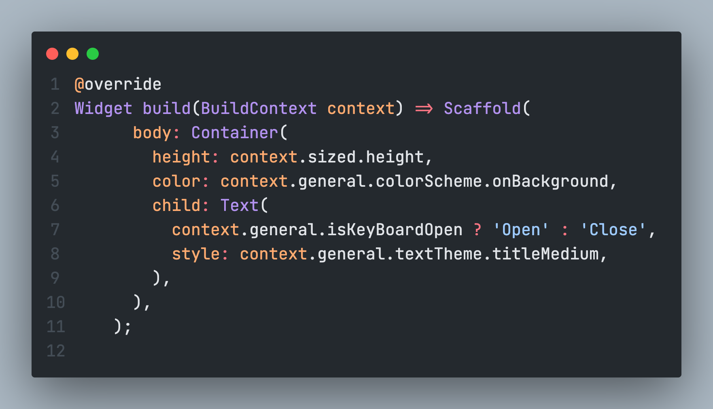
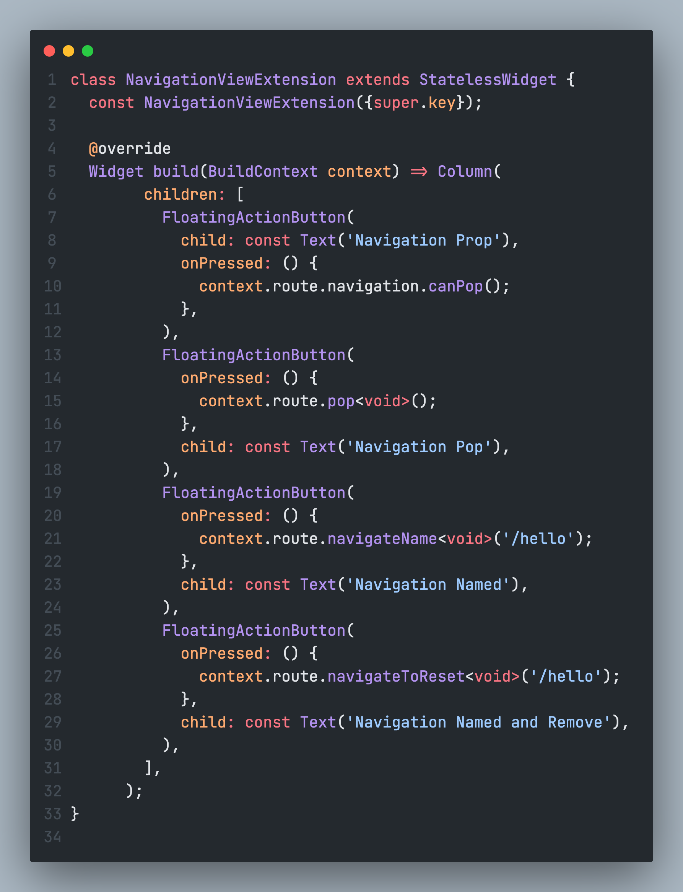
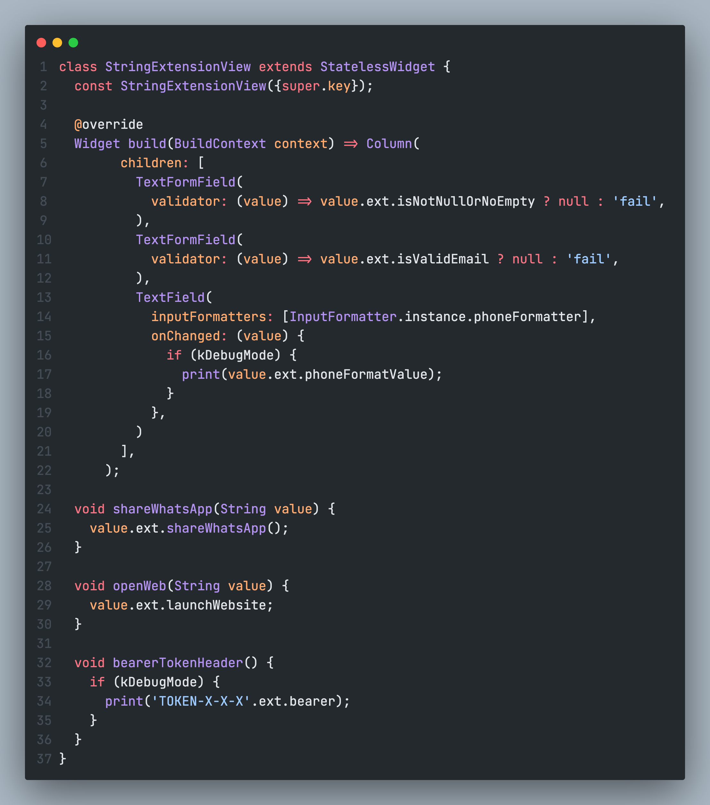
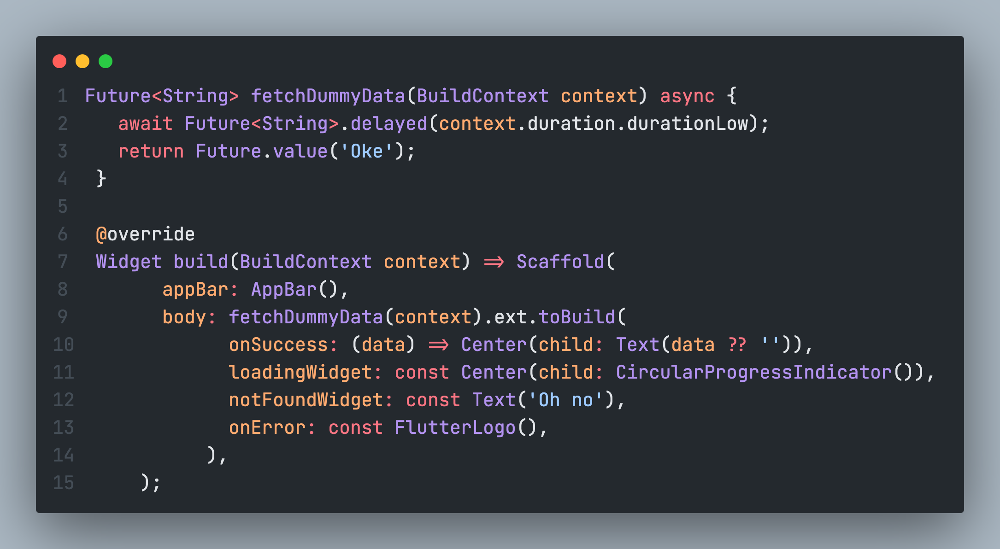
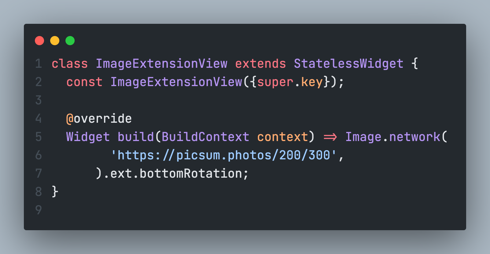
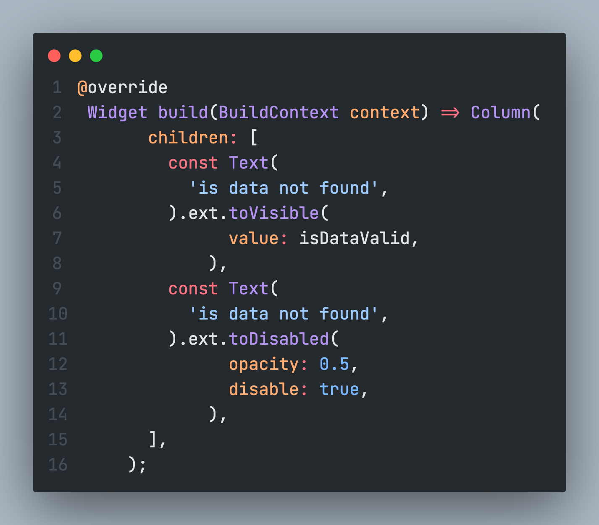

# kartal

My birth country is Kartal, so I created an extension to give born more power.

You should look at the example folder if you want to see an example using these extensions.

[](https://www.buymeacoffee.com/vb10)

## Context extension




You can use context.border to all.

### Border

You can use this extension for border properties with context.border.
For example

`context.border.lowRadius // it equals to device width divided by 0.02`

<details open> 

<summary>Usages:</summary> 

- `context.border.lowRadius` // it equals to device width divided by 0.02
- `context.border.normalRadius` // it equals to device width divided by 0.05
- `context.border.highRadius` // it equals to device width divided by 0.1
- `context.border.normalBorderRadius` // it equals to device width divided by 0.05
- `context.border.lowBorderRadius` // it equals to device width divided by 0.02
- `context.border.highBorderRadius` // it equals to device width divided by 0.1
- `context.border.roundedRectangleBorderLow` // it equals to device width divided by 0.02
- `context.border.roundedRectangleAllBorderNormal` // it equals to device width divided by 0.05
- `context.border.roundedRectangleBorderNormal` // it equals to device width divided by 0.02
- `context.border.roundedRectangleBorderMedium` // it equals to device width divided by 0.04
- `context.border.roundedRectangleBorderHigh` // it equals to device width divided by 0.1

</details>


### Device

You can use for device properties with context.device. For example: `context.device.isSmallScreen`

<details>
<summary> Usages: </summary>

- `context.device.isSmallScreen` // The range is defined as `0 <= width < 300`.
- `context.device.isMediumScreen` // The range is defined as `300 <= width < 600`.
- `context.device.isLargeScreen` // The range is defined as `600 <= width < 900`.
- `context.device.isAndroidDevice` // Returns true if the device is an Android device.
- `context.device.isIOSDevice`  // Returns true if the device is an iOS device.
- `context.device.isWindowsDevice` // Returns true if the device is a Windows device.
- `context.device.isLinuxDevice` // Returns true if the device is a Linux device.
- `context.device.isMacOSDevice` // Returns true if the device is a macOS device.
 </details>


### General

You can use for general properties with context.general. For example: `context.general.appTheme`

<details>
<summary> Usages: </summary>

- `context.general.mediaQuery` (MediaQueryData)
- `context.general.appTheme` (ThemeData)
- `context.general.textTheme` (TextTheme)
- `context.general.primaryTextTheme` (TextTheme)
- `context.general.colorScheme` (ColorScheme)
- `context.general.randomColor` (MaterialColor)
- `context.general.isKeyBoardOpen` // Returns true if the keyboard is open.
- `context.general.keyboardPadding` // When the keyboard is open, it returns the padding value of the keyboard.
- `context.general.appBrightness` (Brightness)
 </details>

### Navigation




You can use for default navigation properties with context.navigation. For example: `context.navigation.pop()`

<details>
<summary> Usages: </summary>

- `context.navigation.pop` // Pops the current route off the navigator.
- `popWithRoot` /// Pops the current route off the navigator and returns to the root route.
- `navigateName<T extends Object?>` // Pushes a named route onto the navigator.
- `navigateToReset<T extends Object?>` // Pushes a named route onto the navigator and removes all previous routes.
- `navigateToPage<T extends Object?>` // Pushes a new route onto the navigator.
  </details>


### Padding

You can use for padding properties with context.padding. For example: `context.padding.low`

<details>
<summary> Usages: </summary>

>  low is 0.01, normal is 0.02, medium is 0.04, high is 0.1 of the device height. (Basically, it is a percentage of the device height.)

- `context.padding.low` // Add [0.01 percentage of device height ] padding to all sides
- `context.padding.normal`// Add [0.02 percentage of device height ] padding to all sides
- `context.padding.medium` //  Add [0.04 percentage of device height ] padding to all sides
- `context.padding.high` // Add [0.1 percentage of device height ] padding to all sides
- `context.padding.horizontalLow` // Add [0.01 percentage of device height ] padding to horizontal sides
- `context.padding.horizontalNormal` // Add [0.02 percentage of device height ] padding to horizontal sides
- `context.padding.horizontalMedium` // Add [0.04 percentage of device height ] padding to horizontal sides
- `context.padding.horizontalHigh` // Add [0.1 percentage of device height ] padding to horizontal sides
- `context.padding.verticalLow` // Add [0.01 percentage of device height ] padding to vertical sides
- `context.padding.verticalNormal` // Add [0.02 percentage of device height ] padding to vertical sides
- `context.padding.verticalMedium` // Add [0.04 percentage of device height ] padding to vertical sides
- `context.padding.verticalHigh` // Add [0.1 percentage of device height ] padding to vertical sides
- `context.padding.onlyLeftLow` // Add [0.01 percentage of device height ] padding to left side
- `context.padding.onlyLeftNormal` // Add [0.02 percentage of device height ] padding to left side
- `context.padding.onlyLeftMedium` 
- `context.padding.onlyLeftHigh` // Add [0.1 percentage of device height ] padding to left side
- `context.padding.onlyRightLow` // Add [0.01 percentage of device height ] padding to right side
- `context.padding.onlyRightNormal` // Add [0.02 percentage of device height ] padding to right side
- `context.padding.onlyRightMedium` // Add [0.04 percentage of device height ] padding to right side
- `context.padding.onlyRightHigh`  // Add [0.1 percentage of device height ] padding to right side
- `context.padding.onlyBottomLow` // Add [0.01 percentage of device height ] padding to bottom side
- `context.padding.onlyBottomNormal` // Add [0.02 percentage of device height ] padding to bottom side
- `context.padding.onlyBottomMedium` // Add [0.04 percentage of device height ] padding to bottom side
- `context.padding.onlyBottomHigh` // Add [0.1 percentage of device height ] padding to bottom side
- `context.padding.onlyTopLow` // Add [0.01 percentage of device height ] padding to top side
- `context.padding.onlyTopNormal` // Add [0.02 percentage of device height ] padding to top side
- `context.padding.onlyTopMedium` // Add [0.04 percentage of device height ] padding to top side
- `context.padding.onlyTopHigh` // Add [0.1 percentage of device height ] padding to top side

</details>

### Size

You can use for size properties with context.sized. For example: `context.sized.low`

<details>
<summary> Usages: </summary>


- `context.sized.height` // Height of the current device.
- `context.sized.width` // Width of the current device.
- `context.sized.lowValue` // 0.01 percentage of the current widget's height.
- `context.sized.normalValue` // 0.02 percentage of the current widget's height.
- `context.sized.mediumValue` // 0.04 percentage of the current widget's height.
- `context.sized.highValue` // 0.1 percentage of the current widget's height.
- `context.sized.dynamicWidth(double val)` // Calculates and returns a dynamic width value based on the provided `val` and the current widget's width.
- `context.sized.dynamicHeight(double val)` // Calculates and returns a dynamic height value based on the provided `val` and the current widget's height.
- `context.sized.emptySizedWidthBoxLow` // 0.01 percentage to width empty width box
- `context.sized.emptySizedWidthBoxLow3x` // 0.03 percentage of width to empty width box
- `context.sized.emptySizedWidthBoxNormal`// 0.05 percentage to width empty width box
- `context.sized.emptySizedWidthBoxHigh` // 0.1 percentage to width empty width box
- `context.sized.emptySizedHeightBoxLow` // 0.01 percentage to height empty height box
- `context.sized.emptySizedHeightBoxLow3x` // 0.03 percentage of height to empty height box
- `context.sized.emptySizedHeightBoxNormal` // 0.05 percentage to height empty height box
- `context.sized.emptySizedHeightBoxHigh` // 0.1 percentage to height empty height box

</details>

## Popup

You can use context.popupManager to all

- `showLoader` (Function): A method shows loader indicator by pushing a `DialogRoute`. Takes optional `id`, `barrierDismissible` and `widgetBuilder`.
- `hideLoader` (Function): A method hides current active loader by removing `DialogRoute`. Takes optional `id`. If `id` is not provided will close latest one.

## String extension




You can use for string properties with string.ext. For example: `string.ext.toCapitalized()`

<details>
<summary> Usages: </summary>

- `'SAMPLE'.lineLength` (int): Returns the number of lines in the string.
- `'SAMPLE'..color` (Color): Returns a Color object parsed from the string.
- `'SAMPLE'.toCapitalized()` (String): Converts the first letter of the string to a capital letter.
- `'SAMPLE'.toTitleCase()` (String): Converts all letters of the string to title case.
- `'SAMPLE'.colorCode` (int?): Returns the color code parsed from the string.
- `'SAMPLE'.toColor` (Color): Returns a Color object from the color code.
- `'SAMPLE'.isNullOrEmpty` (bool): Returns true if the string is null or empty.
- `'SAMPLE'.isNotNullOrNoEmpty` (bool): Returns true if the string is not null and not empty.
- `'SAMPLE'.isValidEmail` (bool): Checks if the string is a valid email address.
- `'SAMPLE'.isValidPassword` (bool): Checks if the string is a valid password.
- `'SAMPLE'.withoutSpecialCharacters` (String?): Removes all diacritics from the string.
- `'SAMPLE'.phoneFormatValue` (String): Returns the value of the phone number without formatting characters.
- `'SAMPLE'.timeFormatValue` (String): Formats the value of the string as a time.
- `'SAMPLE'.timeOverlineFormatValue` (String): Unmasks the text for the time overline format.
- `'SAMPLE'.randomImage` (String): Returns a URL for a random image.
- `'SAMPLE'.randomSquareImage` (String): Returns a URL for a random square image.
- `'SAMPLE'.customProfileImage` (String): Returns a URL for a custom profile image.
- `'SAMPLE'.customHighProfileImage` (String): Returns a URL for a custom high-resolution profile image.
- `'SAMPLE'.bearer` (Map<String, dynamic>): Returns a map with a bearer token.
- `'SAMPLE'.launchEmail` (Future<bool>): Launches the email app with the email address.
- `'SAMPLE'.launchPhone` (Future<bool>): Launches the phone app with the phone number.
- `'SAMPLE'.launchWebsite` (Future<bool>): Launches the website with the string as the URL.
- `'SAMPLE'.launchWebsiteCustom` (Future<bool>): Launches the website with custom configuration.
- `'SAMPLE'.launchMap` (Future<bool>): Launches the map with any value.
- `'SAMPLE'.shareWhatsApp()` (Future<void>): Shares the string via WhatsApp.
- `'SAMPLE'.shareMail(String title)` (Future<void>): Shares the string via email with a title.
- `'SAMPLE'.share()` (Future<void>): Shares the string.
- `'SAMPLE'.appName` (String): Returns the name of the app.
- `'SAMPLE'.packageName` (String): Returns the package name of the app.
- `'SAMPLE'.version` (String): Returns the version of the app.
- `'SAMPLE'.buildNumber` (String): Returns the build number of the app.
- `'SAMPLE'.deviceId` (Future<String>): Returns the unique device ID.

</details>

## File extension

You can use for file properties with file.ext. For example: `file.ext.fileType`

<details>
<summary> Usages: </summary>

- `File().ext.fileType` (FileType): Returns the FileType of the file based on its MIME type.
- `File().ext.isImageFile` (bool): Returns true if the file is of type FileType.IMAGE.
- `File().ext.isVideoFile` (bool): Returns true if the file is of type FileType.VIDEO.
- `File().ext.isAudioFile` (bool): Returns true if the file is of type FileType.AUDIO.
- `File().ext.isTextFile` (bool): Returns true if the file is of type FileType.TEXT.

</details>

## Future extension



You can use for future properties with future.ext. For example: `future.ext.toBuild`

- `toBuild` (Widget): Builds a widget based on the state of a future. It allows specifying different widgets for different states, such as loading, success, not found, and error.
  - `onSuccess` (required): Widget Function(T? data) - Specifies the widget to display when the future completes successfully. It receives the data from the future as a parameter.
  - `loadingWidget` (required): Widget - Specifies the widget to display while the future is loading or in an active state.
  - `notFoundWidget` (required): Widget - Specifies the widget to display when the future has no connection state.
  - `onError` (required): Widget - Specifies the widget to display when an error occurs during the future's execution.
  - `data` (optional): T? - The initial data to provide to the future builder.

- `timeoutOrNull` (T or null) When operation complete before the timeout limit it will return data. if any problem accrued it will return null.
  - `timeOutDuration` (required): Duration - Specifies the timeout duration. Default value is 10 seconds.
  - `enableLogger`, (optional): It will print your error issues in debug console.

## Image Extension





You can use for Image widget properties with Image.ext. For example: `Image.ext.rightRotation`

- `rightRotation` (Widget): Returns a [RotationTransition] widget that applies a right rotation animation to the image.
- `upRotation` (Widget): Returns a [RotationTransition] widget that applies an up rotation animation to the image.
- `bottomRotation` (Widget): Returns a [RotationTransition] widget that applies a bottom rotation animation to the image.
- `leftRotation` (Widget): Returns a [RotationTransition] widget that applies a left rotation animation to the image.

## Key Extension

You can use for GlobalKey properties with key.ext. For example: `Key().ext.offSet`

- `GlobalKey.rendererBox`
  - Returns the `RenderBox` associated with the current widget.
  - Return Type: `RenderBox?`

- `GlobalKey.offset`

  - Returns the global offset of the current widget.
  - Return Type: `Offset?`

- `GlobalKey.height`

  - Returns the height of the current widget.
  - Return Type: `double?`

- `GlobalKey.scrollToWidget`
  - Scrolls to the current widget.
  - Parameters:
    - `alignmentPolicy` (optional): The alignment policy during scrolling. Default: `ScrollPositionAlignmentPolicy.explicit`.
  - Return Type: `void`

## Asset Reader

You can parse your asset file with generic way.

```dart
   final posts = await BundleDecoder('assets/placeholder.json')
        .crackBundle<Post, List<Post>>(model: Post());
```

## Iterable Extension

You can use for Iterable properties with iterable.ext. For example: `iterable.ext.makeSafe()`

- `[null,1].makeSafe()` // Returns a list with non-null values.
- `[null,1].makeSafeCustom(bool Function(T? value) onHandle)` // Returns a list with non-null values based on the custom function.

## List Extension

You can use for List properties with list.ext. For example: `list.ext.isNotNullOrEmpty`

- `[].isNullOrEmpty` // Returns true if the list is null or empty.
- `[]?.isNotNullOrEmpty` // Returns true if the list is not null and not empty.
- `[]?.indexOrNull(bool Function(T) search)` // Returns the index of the first element that satisfies the provided search function.

## Widget extension




You can use for Widget properties with widget.ext. For example: `widget.ext.toVisible()`

- `Widget.toVisible({bool value = true})` // Returns a widget with visibility based on the value.
- `Widget.toDisabled({bool? disable, double? opacity})` // Returns a widget with disabled properties based on the value.
- `Widget.sliver` // Returns a sliver version of the current widget.

## Utility

You can use for utility properties with utility. For example: `Utility.openAppleMapsWithQuery`

- `MapsUtility.openAppleMapsWithQuery`, `MapsUtility.openGoogleMapsWithQuery`, `MapsUtility.openGoogleWebMapsWithQuery`, // Opens the map with the query.
- `CustomLinkPreview.getLinkPreviewData` // Gets the link preview data.
- `CustomLogger.showError` // Shows an error message in .
- `BundleDecoder('assetPath').crackBundle` // Decodes the asset file.

## License

[](/LICENSE)

2020 created for @VB10

## Youtube Channel

[](https://www.youtube.com/watch?v=UCdUaAKTLJrPZFStzEJnpQAg)

## Contributors

<a href="https://github.com/vb10/kartal/graphs/contributors">
  
</a>

Made with [contrib.rocks](https://contrib.rocks).
